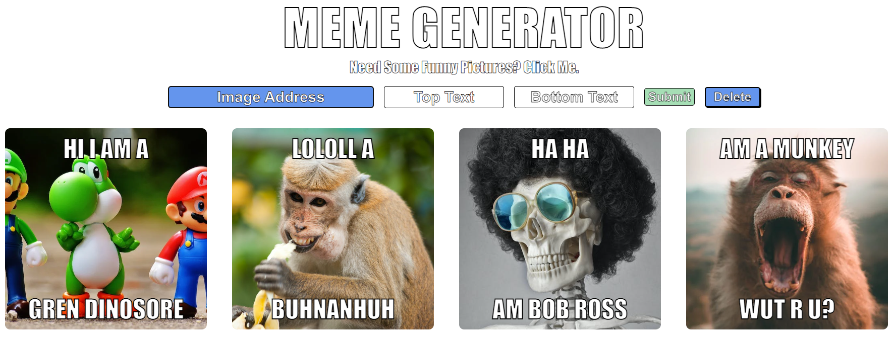

# Meme-Generator

Meme generator where the user can paste in an image URL, add "top text", "bottom text", and generate a meme. Saves to local storage and populates previous memes from local storage. A delete button toggles the ability to delete memes by clicking on them.

     

## My Contribution
The entirety of this project was written by me. No starter code was provided.
